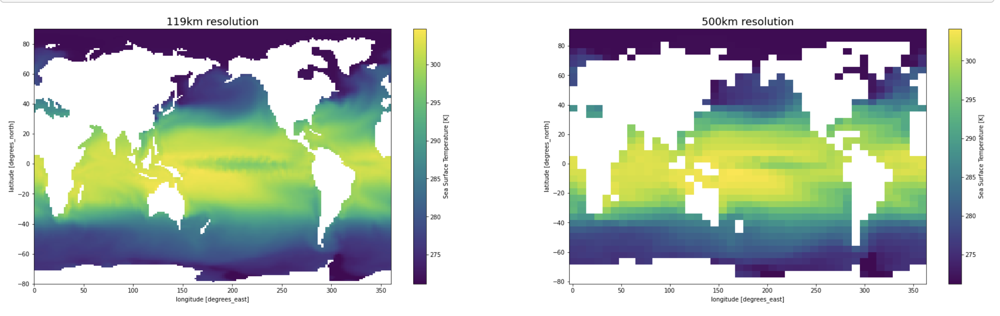
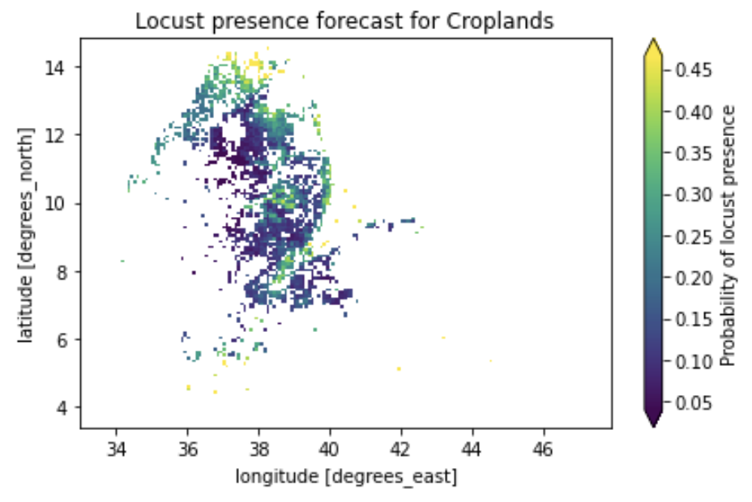

# Model Insight Patterns

This repo contains various Python patterns for model post-processing. These patterns are designed to improve modelers' ability to derive insights from their models native outputs. 

These are organized into 5 directories, each of which will ultimately contain examples for executing the pattern against NetCDF, GeoTIFF, and CSV model outputs. These directories are:

1. `regrid`
2. `time-scale`
3. `clipping`
4. `analytics`
5. `conversions`

## Model Regridding

Regridding a model output involves either upscaling or downscaling the model output to a desired resolution. Typically this should be no more fine grained that 2.5 arc minutes (roughly 4.5km resolution per grid cell).

Regridding can be accomplished by specifying a new grid cell size or by using a reference grid. Modelers should also consider the aggregation function; typically this is either a `sum` or an interpolation (`linear` or `nearest`).

## Time Scaling

The goal of adjusting a model's time scale is to ensure that the time resolution is sufficiently coarse grained to readily facilitate end-user insight generation. Typically this is monthly or greater resolution. Models whose output is hourly or daily should be time scaled to a more coarse grained resolution.

## Clipping

Often, a model produces output for a large area or even the entire globe. However, analysts often only care about a specific region. Here we provide patterns for clipping a model's output to geographies (e.g. countries) of interest.

## Analytics

We primarily focus on two categories of analytics: those derived by leveraging population data and those derived by leveraging land cover masks. Here we demonstrate how to join model output with population and land cover masks in order to generate insights at the human scale.

## Conversions

These short notebooks provide recipies for converting model output from one format to another, for example comma-seperated values (.csv) to NetCDF (.nc).

