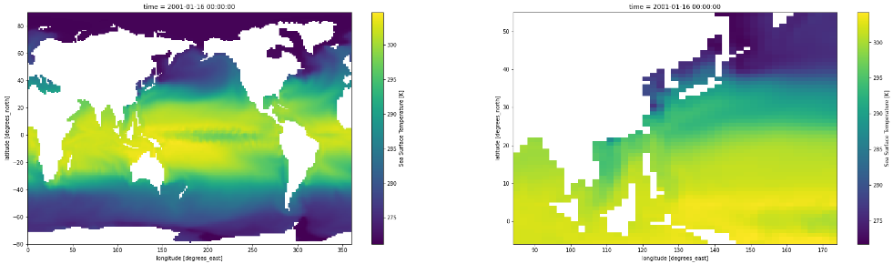

# Model Insight Patterns - Clipping

This directory contains various Python patterns for model post-processing clipping whereby the boundaries of model output are clipped to reference or fixed geographies of interest. These patterns are designed to improve modelers' ability to derive insights and identify impacts from their models native outputs. 


# Requirements

Each Jupyter notebook in this directory requires some or all of the following Python libraries:
```
cdo==1.5.5
geopandas==0.9.0
matplotlib==3.4.2
netCDF4==1.5.7
numpy==1.20.3
rioxarray==0.7.1
xarray==0.18.2
```
You'll need to [install CDO](https://code.mpimet.mpg.de/projects/cdo/wiki#Installation-and-Supported-Platforms) (Climate Data Operators command line suite) before implementing the Python cdo library. Make sure to follow instructions for your specific OS.

# Data Files

The examples use five (5) data sources:
1. `GADM`
2. `Sea Surface Temperature Data`
3. `GPW Population Data`
4. `GeoTIFF sample`
5. `LPJmL model sample output`

## GADM

The Database for Global Administrative Areas ([GADM](https://gadm.org/data.html)) provides geometries that can be used to regrid model output to countries of interest.

The GADM administrative area zero shape file for countries of the world can be downloaded and unziped using the following shell commands:
```
wget https://jataware-world-modelers.s3.amazonaws.com/analytic-layers/gadm_0.zip
unzip gadm_0.zip
rm *.zip
```

## Sea Surface Temperature Data

This NetCDF file contains global sea surface temperatures for 24 time points.

It can be downloaded from S3 with the following shell command:
```
wget https://jataware-world-modelers.s3.amazonaws.com/analytic-layers/sample_2.nc
```

## GPW Population Data

The SEDAC Gridded Popolation of the World([GPW](https://sedac.ciesin.columbia.edu/data/collection/gpw-v4)), v4 collection models the distribution of human population on a continuous raster surface that can be merged with model output. 

GPW download requires sign up at [GPW 4 access here](https://sedac.ciesin.columbia.edu/data/collection/gpw-v4).


## GeoTIFF sample

A sample GeoTIFF file with about 5 Km resolution can be downloaded with the following shell command:
```
wget https://jataware-world-modelers.s3.amazonaws.com/analytic-layers/sample.tif
```


## LPJmL model sample output

A sample NetCDF file based on the LPJmL model's output can be downloaded with the following shell command:
```
wget https://jataware-world-modelers.s3.amazonaws.com/analytic-layers/sample.nc
```
The example NetCDF has the following Dimensions:
```
time: 4 crop: 26 latitude: 280 longitude: 720
```
and Data variables: 
```
harvested_area, harvest, production, irrigation_water, sdate, hdate, NameCrop, weather_year
```

The time variables are dropped in the Python patterns notebooks due to issues when clipping the dataset with these variables present.


# Examples

There are three (3) clipping examples:

1. `clipping-geotiff`
2. `clipping-to-fixed`
3. `clipping-to-reference`


## clipping-geotiff

This example starts with sample GeoTIFF data of a large area at roughly 5 Km resolution. It is clipped to a smaller area of East African countries of interest and saved to a new GeoTIFF file.


## clipping-to-fixed

A sample NetCDF file containing global sea surface temperatures for 24 time points is clipped to specified latitude and longitude parameters.



## clipping-to-reference

This example starts with a sample NetCDF file based on the LPJmL model's output and the GPW population data. These datasets are clipped to the geographical boundaries for countries of interest using the GADM shape file.
