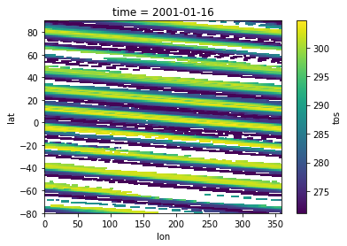
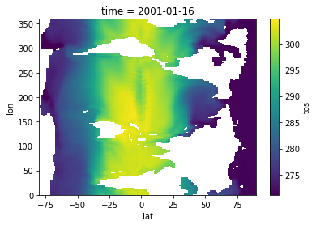
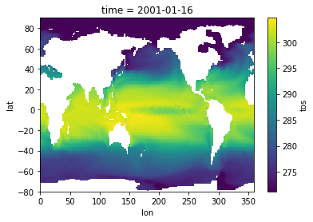

# Model Insight Patterns - Conversions

This directory contains various Python patterns for model post-processing file converions, for example comma-separated values (.csv) to NetCDF (.nc). The product of such a conversion could then be post-processed using one of the other Insight Patterns methods.


# Requirements

Each Jupyter notebook in this directory requires some or all of the following Python libraries:
```
matplotlib==3.4.2
netCDF4==1.5.7
numpy==1.20.3
pandas==1.3.3
seaborn==0.11.1
xarray==0.18.2
```

# Data Files

The examples use one (1) data source:
1. `Sea Surface Temperature Data`

## Sea Surface Temperature Data

This CSV file contains global sea surface temperatures for 24 time points.

It can be downloaded from S3 with the following shell command:
```
wget https://jataware-world-modelers.s3.amazonaws.com/analytic-layers/sample.csv
```


# Examples

There is one (1) conversion example:

1. `csv2netcdf`

## csv2netcdf

A sample CSV file containing global sea surface temperatures for 24 time points is converted to a NetCDF (.nc) file. Some conversion pitfalls are demonstrated.


