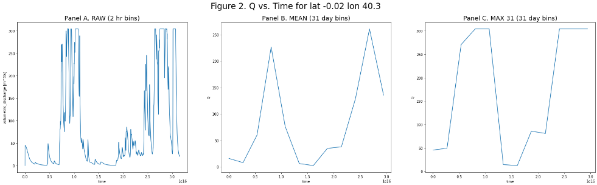

# Model Insight Patterns - Time Scale

This directory contains various Python patterns for model post-processing time scaling to modify the temporal resolution of model output. These patterns are designed to improve modelers' ability to derive insights and identify impacts from their models' native outputs. 


# Requirements

Each Jupyter notebook in this directory requires some or all of the following Python libraries:
```
matplotlib==3.4.2
numpy==1.20.3
xarray==0.19.0
```

# Data Files

The examples use one (1) data source:
1. `Topoflow model sample output`


## Topoflow model sample output

A sample NetCDF file based on the Topoflow model's output can be downloaded with the following shell command:
```
wget https://jataware-world-modelers.s3.amazonaws.com/analytic-layers/timescale_sample_1.nc
```
The example NetCDF has the following Dimensions:
```
time: 4380 X: 131 Y: 115
```
and Data variables: 
```
Q: volumetric discharge
```

# Examples

There is one (1) time scale example:

1. `timescale-resample-netcdf`


## timescale-resample-netcdf

A sample NetCDF file, based on the Topoflow model's output, is loaded and the time scale resolution resampled from 120 minutes to 1 month using two methods: mean() and sum(). The resulting data is plotted either at a single time point or a single coordinate.




